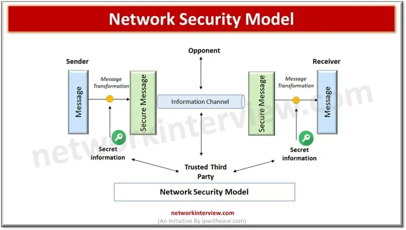

# ✅ **Q1. Classify different types of security attacks and illustrate each with example**

*(10-marks — detailed, structured, simple language)*

Security attacks refer to actions taken by an attacker to break confidentiality, integrity, or availability of information. These attacks aim to steal data, modify it, or stop systems from working. They are mainly classified into **Passive attacks** and **Active attacks**. Each type has its own purpose and impact.

---

## **1. Passive Attacks**

These attacks only **observe** the data flowing in the network without making any changes.
Goal: To **steal information secretly**.

### **a) Eavesdropping (Release of Message Contents)**

The attacker listens to network communication.
**Example:**
Reading someone’s email or monitoring an online banking session using packet sniffers.

### **b) Traffic Analysis**

Even if the data is encrypted, attackers analyze patterns like who is communicating, frequency, and duration.
**Example:**
Observing increased traffic between two company branches to guess a confidential activity.

### **Characteristics of Passive Attacks**

* Hard to detect because nothing is altered
* Affects **confidentiality**
* Protection requires strong encryption

---

## **2. Active Attacks**

These attacks **modify**, **damage**, or **interrupt** communication.
Goal: To **change data**, **inject messages**, or **stop services**.

Active attacks are further classified as:

---

### **a) Masquerade Attack (Impersonation)**

An attacker pretends to be an authorized user.
**Example:**
Logging into a bank account using stolen username and password to transfer funds.

---

### **b) Replay Attack**

Valid data is recorded and sent again to trick the system.
**Example:**
Capturing a valid login request and sending it again to gain unauthorized access.

---

### **c) Modification of Messages**

The attacker changes the content of a message in transit.
**Example:**
Changing the amount in a money transfer request from ₹1,000 to ₹10,000.

---

### **d) Denial of Service (DoS) Attack**

The attacker floods the network or system with traffic so that it becomes unavailable.
**Example:**
Sending millions of requests to a website so that real users cannot access it.

---

### **e) Man-in-the-Middle Attack (MITM)**

Attacker secretly sits between two communicating parties and alters or reads data.
**Example:**
Intercepting communication between a user and a Wi-Fi router to steal login details.

---

## **3. Insider Attacks**

Attacks performed by employees or trusted individuals who misuse authorized access.
**Example:**
An employee stealing customer data from the internal database.

---

## **4. Malware Attacks**

Malicious software used to harm systems.

### **Types:**

* **Virus** – attaches to programs
* **Worm** – spreads automatically
* **Trojan** – disguised as useful software
* **Ransomware** – locks files until ransom is paid

**Example:**
WannaCry ransomware attack affecting hospitals and companies worldwide.

---

## **5. Phishing and Social Engineering**

Tricking users into giving passwords or personal data.
**Example:**
Fake emails pretending to be from a bank asking to “update account details.”

---

## **Conclusion**

Security attacks come in many forms, each affecting confidentiality, integrity, or availability. Understanding attack types helps in designing better protection mechanisms like encryption, authentication, access control, and monitoring systems.

---

# ✅ **Q2. Examine the impact of different types of security attacks**

*(10-marks — detailed, structured, simple language)*

Security attacks have serious consequences for individuals, companies, and governments. Their impact can be divided into effects on **confidentiality**, **integrity**, **availability**, **reputation**, and **financial loss**.

---

# **1. Impact on Confidentiality**

Attacks like eavesdropping, data theft, malware, and MITM expose private information.

### **Examples & Effects**

* Leakage of passwords, financial details
* Loss of personal privacy
* Exposure of trade secrets
* Identity theft
  Confidentiality loss can destroy trust between customers and organizations.

---

# **2. Impact on Integrity**

Integrity attacks modify or corrupt data.

### **Examples & Effects**

* Unauthorized changes in bank balances
* Manipulated medical records
* Tampered emails or files
  When data becomes unreliable, decision-making becomes dangerous and systems cannot be trusted.

---

# **3. Impact on Availability**

DoS, DDoS, ransomware, and hardware attacks disrupt access to services.

### **Examples & Effects**

* Websites becoming unreachable
* Online banking going down
* Hospitals unable to access patient data
  Availability failure affects essential services and creates frustration and financial loss.

---

# **4. Financial Impact**

Security attacks often lead to direct and indirect financial losses.

### **Examples & Effects**

* Paying ransom in ransomware attacks
* Loss of business due to downtime
* Legal penalties due to data breaches
* Cost of rebuilding systems and improving security
  Companies like Yahoo and Equifax lost millions due to breaches.

---

# **5. Impact on Reputation and Trust**

Organizations may lose customers and credibility.

### **Examples & Effects**

* Customers stop using a service after a data leak
* Bad media coverage affects business value
* Investors may lose confidence
  Once reputation is damaged, it is difficult to rebuild.

---

# **6. Operational Disruptions**

Attacks disrupt daily workflows and cause delays.

### **Examples & Effects**

* Employees unable to access internal networks
* Manufacturing systems stopping due to cyberattacks
* Re-routing operations to temporary systems
  Disruptions increase costs and reduce productivity.

---

# **7. Legal and Compliance Issues**

Organizations must follow laws like GDPR.

### **Examples & Effects**

* Heavy fines for failing to protect user data
* Legal cases filed by customers
* Mandatory notifications and investigations
  Failure to comply with regulations can damage the company's standing.

---

# **8. National Security & Critical Infrastructure Risks**

Cyberattacks on government networks, power grids, transportation, or defense systems can cause severe national damage.

### **Examples & Effects**

* Attacks on nuclear plants
* Railway or airport control system failures
* Spying on military networks

---

# **9. Social and Psychological Impact**

Attacks may create fear or loss of confidence among the public.

### **Examples & Effects**

* Worry about privacy
* Fear of digital payments
* Reduced trust in online systems

---

# **Conclusion**

Security attacks have far-reaching consequences that go beyond technical damage. Their impact affects finances, reputation, operations, and even national security. Therefore, organizations must invest in strong security mechanisms, employee training, encryption, monitoring, and incident response plans to reduce the effects of attacks.

---


# ✅ **Q3. Demonstrate how you would assess the need for security and apply suitable security approaches to protect data and network infrastructure.**

*(10 marks — structured, simple language)*

Security in an organization is required to protect its **data, users, systems, and networks** from attacks, misuse, or accidental loss. To secure an environment properly, we first assess the risks and then apply the right security measures.

---

## **1. Assessing the Need for Security**

### **a) Identify what needs protection**

The first step is understanding what assets are important.
Examples:

* Customer data
* Financial information
* Passwords
* Servers, routers, internal networks
* Cloud storage or employee laptops

This helps us understand *where the risk lies*.

### **b) Identify possible threats**

Study all likely threats:

* Hackers
* Malware
* Insider misuse
* Hardware failure
* Accidental data deletion

This gives a clear picture of what can go wrong.

### **c) Identify vulnerabilities**

Find weaknesses in the system.
Examples:

* Weak passwords
* Outdated software
* Unsecured Wi-Fi
* Missing antivirus
* Open ports

This shows *how* attacks could succeed.

### **d) Estimate the impact**

Check how harmful the attack would be.
Examples:

* Data theft → Loss of customer trust
* Website down → Business loss
* File modification → Incorrect decisions

Impact assessment helps prioritize what to secure first.

### **e) Perform a risk evaluation**

Combine threat + vulnerability + impact.
High-risk areas require immediate action.

---

# **2. Applying Suitable Security Approaches**

Once the risks are known, the right security mechanisms are applied.

---

## **a) Access Control (Who can access what)**

* Use strong passwords
* Provide least privilege access (only needed permissions)
* Multi-factor authentication

This stops unauthorized users from entering the system.

---

## **b) Encryption (Protecting data)**

Encrypt:

* Files
* Emails
* Network traffic (HTTPS, SSL, VPN)
  Even if attackers steal data, they cannot read it.

---

## **c) Firewalls and Network Filtering**

Firewalls block unwanted traffic and protect the internal network.
They prevent:

* Unauthorized access
* Scanning
* Many network attacks

---

## **d) Antivirus and Malware Protection**

Stops viruses, worms, ransomware, and spyware from damaging systems.

---

## **e) Security Policies and Employee Training**

Many attacks (phishing, password leaks) occur due to human error.
Training employees about safe usage greatly reduces risk.

---

## **f) Regular Updates and Patch Management**

Attackers often exploit outdated software.
Keeping OS, applications, and network devices updated closes security holes.

---

## **g) Monitoring and Intrusion Detection Systems (IDS)**

These tools detect suspicious activities.
Example:
Login attempts, unusual traffic, malware signatures.

---

## **h) Backups and Recovery Plans**

Backups protect data from:

* Ransomware
* System crashes
* Human errors
  Recovery plans ensure quick restoration of services.

---

# **Conclusion**

Security is not a single step but a continuous cycle: identify risks → apply protections → monitor → improve.
With a combination of encryption, firewalls, access control, training, and backups, an organization can create a strong defense for both data and network infrastructure.

---

# ✅ **Q5. Given a short plaintext message, apply a substitution technique and a transposition technique to encrypt it, showing each step.**

*(10 marks — clear demonstration, simple steps)*

Let us take a simple message and show both types of classical encryption.

---

# **Plaintext:**

**HELLO**

---

# **Part A: Substitution Technique (Caesar Cipher—Shift by 3)**

In substitution encryption, **each letter is replaced with another letter**.

### **Step 1: Choose the rule**

Shift each letter **3 positions forward**.

A → D
B → E
C → F
…
H → K
E → H
L → O
O → R

### **Step 2: Apply to HELLO**

| Letter | Shift +3 |
| ------ | -------- |
| H      | K        |
| E      | H        |
| L      | O        |
| L      | O        |
| O      | R        |

### **Encrypted message (Substitution Cipher):**

**KHOOR**

---

# **Part B: Transposition Technique (Columnar Transposition — Key = 3)**

In transposition encryption, the **positions of letters are rearranged**, but the letters remain the same.

### **Step 1: Write message in rows of 3 columns**

```
H E L
L O X
```

We add **X** as padding because the message length is not a multiple of 3.

### **Step 2: Read column by column**

Column 1: H L
Column 2: E O
Column 3: L X

### **Step 3: Combine column-wise output**

**H L E O L X**
→ **HLEOLX**

### **Encrypted message (Transposition Cipher):**

**HLEOLX**

---

# **Final Output Summary**

| Technique                | Ciphertext |
| ------------------------ | ---------- |
| Substitution (Caesar +3) | **KHOOR**  |
| Transposition (Columnar) | **HLEOLX** |

---

# **Conclusion**

* **Substitution techniques** change the **letters themselves**.
* **Transposition techniques** change the **positions of letters**.
* Using both strengthens security because attackers have to break two different styles of encryption.

---

# ✅ **Q. MODEL FOR NETWORK SECURITY**

*(10-Marks — simple, structured, easy to learn)*

A **Model for Network Security** explains **how two parties communicate safely** over an insecure network. It shows all the essential components required to protect data from attackers and ensure secure communication.

This model is the foundation of almost all modern security systems (SSL, IPSec, VPN, etc.).

---

## **1. Main Components of the Security Model**

### **a) Sender**

The person or system that wants to send a secure message.

### **b) Receiver**

The person or system that receives the message.

### **c) Message (Data)**

The information being transferred (text, files, passwords, banking transactions, etc.).

### **d) Security Transform**

A method used to protect data.
Examples: **Encryption, MAC, digital signature**, etc.

### **e) Secret Information (Key)**

A key is used along with the security transform to protect the message.

### **f) Communication Channel**

The network through which the data travels — usually insecure (Internet).

### **g) Opponent (Attacker)**

Someone trying to read, modify, or block the message.

---

## **2. Flow of the Model (Sender → Network → Receiver)**

### **Step 1: Sender Protects the Message**

Sender applies a security method such as:

* **Encryption** (to keep data secret)
* **Digital signature** (to prove identity)
* **MAC** (to ensure data integrity)

### **Step 2: Message Travels Through the Insecure Network**

The network is untrusted.
Attackers may:

* Read data
* Modify data
* Replay old messages
* Spoof identities

Security mechanisms must stop these.

### **Step 3: Receiver Performs Security Checks**

Receiver uses:

* Key
* Decryption
* Verification

to recover the original message and confirm that:

* It came from the right sender
* It was not modified
* It is fresh and not a replay

---

## **3. Security Services Provided by the Model**

### **a) Confidentiality**

Keeps data secret from attackers (using encryption).

### **b) Integrity**

Ensures message is not altered during transmission.

### **c) Authentication**

Proves the identity of the sender.

### **d) Availability**

Ensures services remain accessible.

### **e) Non-Repudiation**

Sender cannot deny sending the message.

---

## **4. Importance of the Model**

* Acts as a **blueprint** for designing secure systems.
* Helps identify what security service is needed.
* Helps design protocols like **SSL, IPSec, HTTPS, VPN, 5G security**, etc.
* Ensures the right combination of keys, encryption, and verification.

---

## **5. Conclusion**

The Model for Network Security gives a complete systematic structure to secure communication.
By using keys, encryption, authentication, and integrity checks, it ensures safe data transmission even over insecure channels like the Internet.



---

# ✅ **Q. NEED FOR SECURITY**

*(10-Marks — very simple, yet detailed)*

Security is needed because today’s digital world depends entirely on computers, online services, mobile apps, and networks. Without proper security, data, money, identity, and critical services can be easily attacked.

---

## **1. To Protect Confidential Data**

Personal and business information must remain private.
Examples:

* Banking passwords
* Medical records
* Business files
  Without security, attackers can steal or misuse sensitive data.

---

## **2. To Prevent Unauthorized Access**

Only authorized users should access systems.
Security ensures:

* Strong passwords
* Access control
* Authentication
  to stop hackers or unknown people from entering.

---

## **3. To Maintain Data Integrity**

Data must not be altered without permission.
Attackers may try to:

* Change bank amounts
* Modify exam results
* Alter emails or documents
  Security tools ensure the data remains correct and trustworthy.

---

## **4. To Ensure Availability of Services**

Attacks like **DoS** can shut down:

* Websites
* Online banking
* Government services

Proper security keeps systems running without interruptions.

---

## **5. To Prevent Financial Loss**

Security breaches can cause:

* Direct money theft
* Ransomware payments
* Business shutdowns
* Cost of repairing systems

Strong security reduces these risks.

---

## **6. To Protect Organizational Reputation**

A company losing data will lose customer trust.
Examples:

* Data leaks
* Privacy violations
* Hacking incidents

Security protects brand image and customer confidence.

---

## **7. To Comply with Laws and Regulations**

Many laws require organizations to protect data.
Examples:

* GDPR
* IT Act
* Industry standards
  Non-compliance leads to penalties.

---

## **8. To Defend Against Growing Cyber Threats**

Cyberattacks are increasing:

* Phishing
* Malware
* Ransomware
* Insider threats
  Security is essential to counter these evolving attacks.

---

## **9. To Protect National Security**

Government networks, defense systems, power grids, and healthcare require strong security.
Any attack can cause major damage to society.

---

## **10. To Support Safe Digital Transformation**

Modern services depend on secure technology:

* Online banking
* Cloud storage
* e-commerce
* Digital payments
  Security enables safe growth and innovation.

---

# **Conclusion**

Security is needed to protect data, users, systems, money, and national infrastructure.
With increasing cyber threats, strong security measures are essential for trust, privacy, and continuous operation of digital services.

---


# ✅ **Q. SECURITY PRINCIPLES**

*(10 Marks — Clear, structured, easy to learn)*

Security principles are the **fundamental rules** used to design any secure system. They ensure that data, users, and network resources remain safe from attacks and misuse. These principles guide how information should be stored, accessed, transmitted, and protected.

---

## **1. Confidentiality**

Ensures that information is accessible **only to authorized people**.
Examples: passwords, bank details, and personal data must remain secret.
Techniques used: encryption, access control, authentication.

---

## **2. Integrity**

Ensures that information is **accurate and not altered** without permission.
Even a small change in data can cause serious damage.
Techniques: hashing, digital signatures, MAC.

---

## **3. Availability**

Ensures that systems and data are **available when needed**.
Attacks like DoS reduce availability.
Use: backups, load balancers, redundancy.

---

## **4. Authentication**

Verifies the identity of a user or system.
Example: login with username + password, OTP, biometrics.
Ensures the system knows *who* is trying to access data.

---

## **5. Authorization**

Once authenticated, it controls **what the user is allowed to do**.
Example: A student can view marks, but only admins can modify them.

---

## **6. Non-Repudiation**

Ensures that a sender **cannot deny** sending a message later.
Digital signatures provide proof of origin.

---

## **7. Accountability (Auditing)**

Records user activities so that malicious behavior can be traced.
Logs help investigate attacks and misuse.

---

## **8. Least Privilege Principle**

Users should only get the minimal access required to perform their job.
This reduces damage if accounts are hacked.

---

## **9. Defense in Depth**

Use **multiple layers of security** instead of relying on a single one.
Example: firewall + antivirus + encryption + monitoring.

---

## **10. Security Through Simplicity (Keep it simple)**

Complex systems have more weaknesses.
Simple, well-designed systems are easier to protect and manage.

---

## **Conclusion**

Following these security principles helps build strong, reliable, and attack-resistant systems. They reduce vulnerabilities and ensure safe communication, data protection, and trust in digital environments.

---

# ✅ **Q. ENCRYPTION AND DECRYPTION**

*(10 Marks — beginner-friendly 10M answer)*

Encryption and decryption are the **core building blocks** of modern security. They protect data from unauthorized access and ensure safe communication over insecure networks like the internet.

---

## **1. Encryption – Meaning**

Encryption is the process of **converting readable data (plaintext)** into **unreadable data (ciphertext)**.
Purpose: To keep data secret from attackers.

Example:
HELLO → KHOOR (using Caesar cipher shift +3)

---

## **2. Decryption – Meaning**

Decryption is the reverse process where ciphertext is converted **back into plaintext** using a key.

Example:
KHOOR → HELLO

---

## **3. Why Encryption is Needed**

* Protects sensitive data (banking, passwords, personal information)
* Secures communication over the internet
* Prevents eavesdropping and unauthorized access
* Protects stored data on devices and cloud

---

## **4. Elements in Encryption System**

### **a) Plaintext**

Original readable message.

### **b) Ciphertext**

Encrypted unreadable message.

### **c) Key**

Secret value used in encryption/decryption.

### **d) Algorithm**

Rule or method used to transform plaintext to ciphertext.

---

## **5. Types of Encryption**

### **a) Symmetric Encryption**

Same key is used for both encryption and decryption.
Fast and suitable for large data.

### **b) Asymmetric Encryption**

Uses **two different keys** (public and private).
Used for secure key exchange, digital signatures.

---

## **6. Example (Simple)**

Plaintext: HELLO
Method: Caesar +3
Encryption: KHOOR
Decryption: HELLO

This shows how encryption protects data and decryption restores it.

---

## **7. Applications of Encryption**

* WhatsApp message protection
* Online banking
* Password storage
* Cloud file protection
* Secure email (PGP, S/MIME)
* Virtual Private Networks (VPNs)

---

## **Conclusion**

Encryption is essential to protect confidentiality, while decryption ensures the recipient receives the original data safely. Together, they form the backbone of all modern security systems.

---

# ✅ **Q. SYMMETRIC AND ASYMMETRIC CIPHERS / KEYS**

*(10 Marks — simple, detailed, exam-ready)*

Cryptography uses two major types of ciphers to protect data: **Symmetric ciphers** and **Asymmetric ciphers**. Each has its own approach to using keys, its strengths, and its applications.

---

# **1. Symmetric Ciphers (Secret Key Cryptography)**

Both sender and receiver use **the same key** for encryption and decryption.

---

## **a) How it works**

* Sender encrypts plaintext using a secret key.
* Receiver decrypts ciphertext with the same secret key.

---

## **b) Examples of Symmetric Algorithms**

* DES
* AES
* RC5
* Blowfish
* IDEA

---

## **c) Advantages**

* Very fast
* Suitable for encrypting large files, disks, databases
* Low computational cost

---

## **d) Disadvantages**

* Key distribution is difficult
  (How to share the secret key safely?)
* If one key is leaked, the whole system is compromised.

---

## **e) Applications**

* Data-at-rest (storage encryption)
* VPNs
* Wi-Fi security (WPA2)
* File encryption tools

---

# **2. Asymmetric Ciphers (Public Key Cryptography)**

Uses **two different keys**:

* **Public Key** → Used for encryption
* **Private Key** → Used for decryption

These keys are mathematically linked.

---

## **a) How it works**

* Anyone can encrypt using the **public key**
* Only the owner can decrypt with the **private key**

---

## **b) Examples of Asymmetric Algorithms**

* RSA
* Diffie–Hellman
* Elliptic Curve Cryptography (ECC)

---

## **c) Advantages**

* Solves key distribution problem
* Enables digital signatures
* Provides authentication
* Used for secure key exchange

---

## **d) Disadvantages**

* Slower than symmetric algorithms
* Not suitable for encrypting large amounts of data alone

---

## **e) Applications**

* Secure website communication (HTTPS)
* Email security (PGP)
* Digital signatures
* Key exchange for symmetric encryption

---

# **3. Comparison of Symmetric vs. Asymmetric Keys**

| Feature    | Symmetric                   | Asymmetric                    |
| ---------- | --------------------------- | ----------------------------- |
| Key Used   | One key                     | Two keys                      |
| Speed      | Fast                        | Slow                          |
| Security   | Depends on safe key sharing | No key sharing issue          |
| Best Use   | Large data encryption       | Authentication & key exchange |
| Algorithms | AES, DES                    | RSA, DH                       |

---

# **Conclusion**

Symmetric ciphers are best for speed and data encryption, while asymmetric ciphers solve key distribution and provide authentication. In real-world systems, **both are used together**, forming hybrid cryptography (e.g., HTTPS).

---
