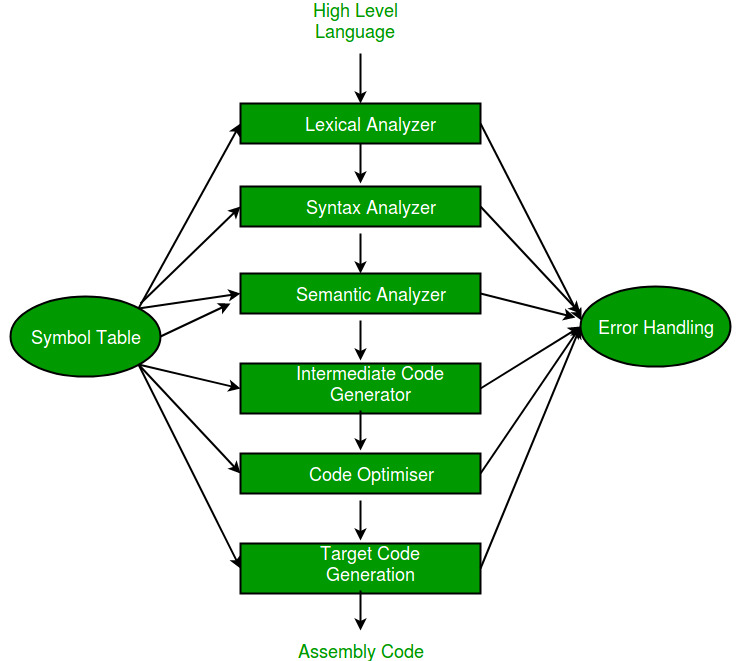

Sure Sri! Here's a **2–4 line answer** for each **Compiler Design short question** you've listed:

---

1. **Define Compiler and draw the diagram for phases of compilation**
   A compiler translates source code into target machine code. It goes through phases: Lexical Analysis → Syntax Analysis → Semantic Analysis → Intermediate Code Generation → Code Optimization → Code Generation → Code Linking.

   

---

2. **Differentiate analysis and synthesis phase**
   The analysis phase breaks down source code and gathers information (front-end), while the synthesis phase constructs the target code using that information (back-end).

---

3. **What is the role of parser and give its classification**
   Parser checks the syntax of code using grammar rules. Types: **Top-down parsing** (LL), **Bottom-up parsing** (LR, SLR, LALR, Canonical LR).

---

4. **What is an ambiguous grammar and give a suitable example**
   A grammar is ambiguous if it can generate more than one parse tree for a string.
   Example: `E → E + E | E * E | id`.

---

5. **Difference between annotated parse tree and dependency graph**
   Annotated parse trees show values of attributes at each node.
   Dependency graphs show the evaluation order of attributes between nodes.

---

6. **Two applications of syntax directed translation**
7. Expression evaluation
8. Intermediate code generation in compilers.

---

7. **How the cost of an instruction is computed?**
   Based on CPU cycles, memory access time, instruction type, and target machine architecture.

---

8. **Write about garbage collection and give language examples**
   Garbage collection reclaims unused memory automatically. Languages: Java, Python, C#.

---

9. **What is code optimization and types**
   Improving code efficiency without changing output. Types: loop optimization, constant folding, dead code elimination, strength reduction.

---

10. **Function preserving transformations**
    Transformations that improve performance without changing program behavior (e.g., loop unrolling, inline expansion).

---

11. **Differentiate token, pattern, lexeme**
    Token: syntactic unit (e.g., keyword),
    Pattern: rule describing token,
    Lexeme: actual string (e.g., `if`).

---

12. **Define: Preprocessor, Assembler, Loader, Linker**

* **Preprocessor**: Handles macros, includes.
* **Assembler**: Converts assembly to machine code.
* **Loader**: Loads code into memory.
* **Linker**: Combines multiple object files.

---

13. **Eliminate left recursion:**

```
E → TE'
E' → +TE' | ε
T → FT'
T' → *FT' | ε
F → (E) | id
```

---

14. **How to collect Canonical Collection of Items**
    Start with augmented grammar, compute closure for each item set, then compute transitions (GOTO) to build the collection.

---

15. **Type checking**
    Ensures operations in code are semantically correct with respect to data types (e.g., no adding int to string).

---

16. **L-attributed definition with example**
    Uses inherited and synthesized attributes with left-to-right dependency.
    Example: `A → B C` where `C.i = B.s`.

---

17. **Instruction ordering in target code generation**
    Reorders instructions for efficient execution while preserving correctness (e.g., minimize pipeline stalls).

---

18. **Representations of intermediate code**
    Three-address code, abstract syntax trees, postfix notation, DAGs.

---

19. **Constant propagation**
    Replaces variables with constant values when known at compile time to reduce computation.

---

20. **Define: Dominators, Back edges**

* **Dominator**: A node A dominates B if every path to B passes through A.
* **Back edge**: An edge pointing back to a dominator, used to detect loops.

---

21. **How compiler generates intermediate code?**
    After semantic analysis, it uses syntax-directed translation rules to create IR like 3-address code or AST.

---

22. **Role of lexical analyser**
    It scans source code and converts it into tokens for the parser. Also removes whitespace and comments.

---

23. **What is Handle Pruning?**
    A bottom-up parsing technique where the handle (rightmost derivation) is reduced step-by-step to reach the start symbol.

---

24. **Eliminate left recursion:**

```
A → cA'
A' → aA' | ε
B → dB'
B' → bB' | ε
```

---

25. **Define L-attributed definition**
    A syntax-directed definition where attributes can be evaluated in one left-to-right traversal (uses inherited and synthesized attributes).

---

26. **DAG for: a+a*(b–c)+(b–c)*d**
    Nodes: `–`, `*`, `+`, with shared subtrees for `(b–c)`. DAG avoids redundant computations by merging common expressions.

---

27. **Define Loop Optimization**
    Improves performance by optimizing code inside loops (e.g., loop invariant code motion, unrolling).

---

28. **Define Code Motion**
    Moves invariant code outside loops to reduce repeated computation and improve performance.

---

29. **Live Variable Analysis**
    Determines which variables hold values that may be used later, helping in register allocation and dead code removal.

---

30. **Machine-independent optimization**
    Optimizations applied before target-specific code generation, like constant folding or dead code elimination.

---

31. **Tokens, Lexemes, Patterns with example**
    Token: `ID`, Lexeme: `x`, Pattern: `[a-zA-Z_][a-zA-Z0-9_]*`
    They form the basis of lexical analysis.

---

32. **Significance of regular expressions in compiler design**
    They describe patterns for tokens, enabling lexical analysis to recognize identifiers, numbers, keywords, etc.

---

33. **List Top-down parsers & brief**

* **Recursive Descent**: Hand-written parser using functions.
* **Predictive Parser**: Uses lookahead & parse table (e.g., LL(1)).

---

34. **Closure operations in grammar**
    For an item `A → α.Bβ`, include all productions of `B` recursively. Closure builds complete item sets for parsing.

---

35. **Specification of a simple type checker**
    Defines type rules for expressions/statements, using symbol table for variables/functions to ensure type correctness.

---

36. **Define S-attributed definition**
    A syntax-directed definition using only synthesized attributes (evaluated bottom-up).

---

37. **Define loop optimization**
    Improving performance by modifying loops (e.g., strength reduction, loop fusion, loop unrolling).

---

38. **Define constant folding**
    Compile-time evaluation of constant expressions (e.g., replacing `2+3` with `5`).

---

39. **Describe peephole optimization**
    Applies small, local changes to machine code (e.g., replacing `MUL 2` with `SHIFT LEFT 1`) to improve efficiency.

---

40. **What is DAG representation?**
    A graph showing operations and values where common sub-expressions are shared to avoid recomputation.

---

Let me know if you want me to send this as a downloadable PDF or split unit-wise!
